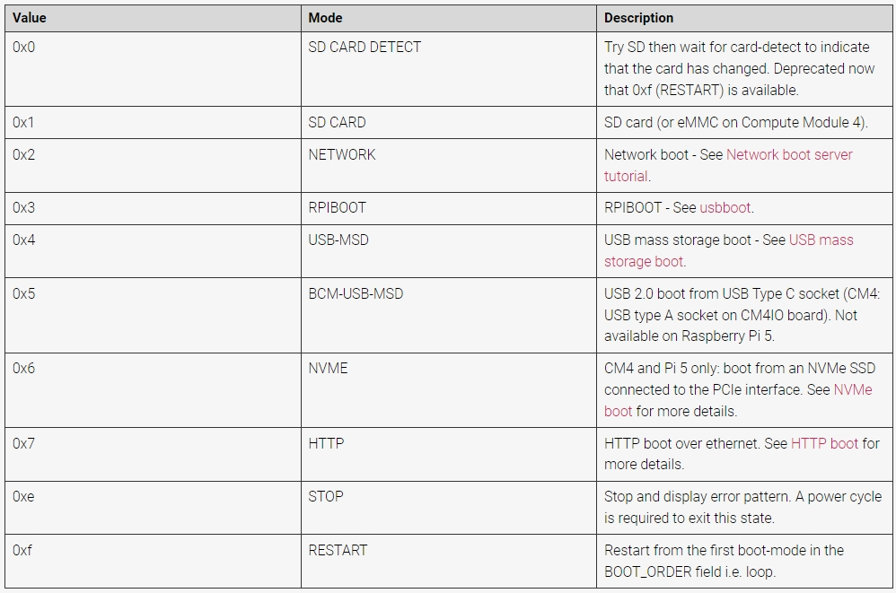

.. note::

    こんにちは、SunFounderのRaspberry Pi & Arduino & ESP32愛好家コミュニティへようこそ！Facebook上でRaspberry Pi、Arduino、ESP32についてもっと深く掘り下げ、他の愛好家と交流しましょう。

    **参加する理由は？**

    - **エキスパートサポート**：コミュニティやチームの助けを借りて、販売後の問題や技術的な課題を解決します。
    - **学び＆共有**：ヒントやチュートリアルを交換してスキルを向上させましょう。
    - **独占的なプレビュー**：新製品の発表や先行プレビューに早期アクセスしましょう。
    - **特別割引**：最新製品の独占割引をお楽しみください。
    - **祭りのプロモーションとギフト**：ギフトや祝日のプロモーションに参加しましょう。

    👉 私たちと一緒に探索し、創造する準備はできていますか？[|link_sf_facebook|]をクリックして今すぐ参加しましょう！

.. _boot_from_ssd:

NVMe SSDからの起動
=============================

1. PCIeの有効化
--------------------

デフォルトではPCIeコネクタは有効になっていません。

* 有効にするには、 ``/boot/firmware/config.txt`` ファイルを開きます。

  .. code-block:: shell
  
    sudo nano /boot/firmware/config.txt
  
* 次に、以下の行をファイルに追加します。

  .. code-block:: shell
  
    # Enable the PCIe External connector.
    dtparam=pciex1
  
* ``pciex1`` のより覚えやすい別名が存在するので、代わりに ``dtparam=nvme`` を ``/boot/firmware/config.txt`` ファイルに追加することもできます。

  .. code-block:: shell
  
    dtparam=nvme

* Gen 2.0の速度（5 GT/秒）で認証されていますが、以下の行を追加することでGen 3.0（10 GT/秒）に強制できます。

  .. code-block:: shell
  
    # Force Gen 3.0 speeds
    dtparam=pciex1_gen=3
  
  .. warning::
  
    Raspberry Pi 5はGen 3.0の速度で認証されておらず、この速度でPCIeデバイスに接続すると不安定になる可能性があります。

* 変更を保存するには、「Ctrl + X」、「Y」、「Enter」を押します。

3. SSDからのブートを設定
---------------------------------------

* Raspberry Piのファームウェアを最新バージョンに更新するには、 ``rpi-update`` を使用します。

.. code-block:: shell

    sudo rpi-update

* ブートサポートを有効にするには、ブートローダー設定の ``BOOT_ORDER`` を変更する必要があります。EEPROM設定を編集します：

.. code-block::
  
    sudo rpi-eeprom-config --edit
  
* 次に、 ``BOOT_ORDER`` の行を以下のように変更します。 ``0xf416``: 最初にNVMe SSDを試し、次にUSB、その後SDカード。

.. code-block:: shell
  
    BOOT_ORDER=0xf146

* ``BOOT_ORDER`` 設定は、異なるブートモードの優先順位を柔軟に設定できます。32ビットの符号なし整数として表され、各ニブルがブートモードを表します。ブートモードは、最も重要でないニブルから最も重要なニブルの順に試みられます。
* ``BOOT_ORDER`` プロパティは、異なるブートモードのシーケンスを定義します。右から左に読み、最大8桁を定義できます。

* ``0xf41``: 最初にSDを試し、次にUSB-MSD、それを繰り返します（`` BOOT_ORDER``が空の場合のデフォルト）
* ``0xf14``: 最初にUSBを試し、次にSD、それを繰り返します

* 更新が完了したら、これらの変更を有効にするためにRaspberry Piを再起動します。

.. code-block:: shell

    sudo reboot

4. SSDにOSをインストール
----------------------------------------

SSDにオペレーティングシステムをインストールする方法は2つあります：

 **Micro SDカードからSSDへのシステムのコピー** 

#. ディスプレイを接続するか、VNC ViewerでRaspberry Piのデスクトップにアクセスします。次に、 **Raspberry Piのロゴ** -> **アクセサリ ** -> ** SDカードコピー機** をクリックします。

    .. image:: img/ssd_copy.png
        :align: center
    
#. 正しい **コピー元** と **コピー先** デバイスを選択してください。それらを間違えないよう注意してください。

    .. image:: img/ssd_copy_from.png
        :align: center
    
#. 選択後、 **開始** をクリックします。

    .. image:: img/ssd_copy_start.png
        :align: center
    
#. SSDの内容が消去されることが確認されます。Yesをクリックする前に、データをバックアップしてください。

    .. image:: img/ssd_copy_erase.png
        :align: center
    
#. しばらく待つと、コピーが完了します。

 **Raspberry Pi Imagerを使用したシステムのインストール** 

Micro SDカードにデスクトップバージョンのシステムがインストールされている場合、イメージツール（Raspberry Pi Imagerなど）を使用してSSDにシステムを焼くことができます。この例ではRaspberry Pi OS bookwormを使用していますが、他のシステムではまずイメージングツールをインストールする必要があるかもしれません。

#. ディスプレイを接続するか、VNC Viewerを通じてRaspberry Piのデスクトップにアクセスします。次に、 **Raspberry Piロゴ** -> **アクセサリ** -> **イメージャー** をクリックします。

    .. image:: img/ssd_imager.png
        :align: center
    
#. イメージャー内で、 **Raspberry Piデバイス** をクリックし、ドロップダウンリストから **Raspberry Pi 5** モデルを選択します。

    .. image:: img/ssd_pi5.png
        :align: center
    
#.  **オペレーティングシステム** を選択し、推奨されるオペレーティングシステムバージョンを選択します。

    .. image:: img/ssd_os.png
        :align: center
    
#.  **ストレージ** オプションで、挿入されたNVMe SSDを選択します。

    .. image:: img/nvme_storage.png
        :align: center
    
#.  **次へ** をクリックし、その後 **設定の編集** をクリックして、OSの設定をカスタマイズします。

    .. note::

        Raspberry Piにモニターがある場合は、次のステップをスキップして「はい」をクリックし、インストールを開始できます。その後、モニターで他の設定を調整します。

    .. image:: img/os_enter_setting.png
        :align: center

#. Raspberry Piの **ホスト名** を定義します。

    .. note::

        ホスト名はRaspberry Piのネットワーク識別子です。 ``<hostname>.local`` または ``<hostname>.lan`` を使用してPiにアクセスできます。

    .. image:: img/os_set_hostname.png
        :align: center

#. Raspberry Piの管理者アカウントの **ユーザー名** と **パスワード** を作成します。

    .. note::

        デフォルトパスワードがないため、一意のユーザー名とパスワードを設定することでRaspberry Piを保護することが重要です。

    .. image:: img/os_set_username.png
        :align: center

#. ワイヤレスLANを設定するために、ネットワークの **SSID** と **パスワード** を入力します。

    .. note::

        ``Wireless LAN country`` を、あなたの場所に対応する二文字の`ISO/IEC alpha2コード `<https://en.wikipedia.org/wiki/ISO_3166-1_alpha-2#Officially_assigned_code_elements>`_ に設定します。

    .. image:: img/os_set_wifi.png
        :align: center

#. Raspberry Piにリモートで接続するには、 **サービス** タブで **SSH** を有効にします。

    * **パスワード認証** の場合、 **一般** タブからユーザー名とパスワードを使用します。
    * 公開キー認証のみを許可する場合は「公開キー認証のみを許可する」を選択します。RSAキーがあればそれを使用します。ない場合は「SSH-keygenを実行」をクリックして新しいキーペアを生成します。

    .. image:: img/os_enable_ssh.png
        :align: center

#.  **オプション** メニューでは、書き込み時のImagerの動作を設定できます。これには、完了時に音を鳴らす、メディアを排出する、テレメトリを有効にするなどが含まれます。

    .. image:: img/os_options.png
        :align: center

    
#. OSカスタマイズ設定の入力が完了したら、 **保存** をクリックしてカスタマイズを保存します。その後、イメージ書き込み時にそれらを適用するために「はい」をクリックします。

    .. image:: img/os_click_yes.png
        :align: center

#. NVMe SSDに既存のデータがある場合、データ損失を防ぐためにバックアップしてください。バックアップが不要な場合は「はい」をクリックして進みます。

    .. image:: img/nvme_erase.png
        :align: center

#. 「書き込み成功」というポップアップが表示されたら、イメージが完全に書き込まれて検証されたことを意味します。これでNVMe SSDからRaspberry Piを起動する準備ができました！

    .. image:: img/nvme_install_finish.png
        :align: center

**5. Pironman 5の再起動** 
--------------------------------

Pironman 5を再起動すると、SSDから起動します。

  .. code-block:: shell

    sudo reboot
