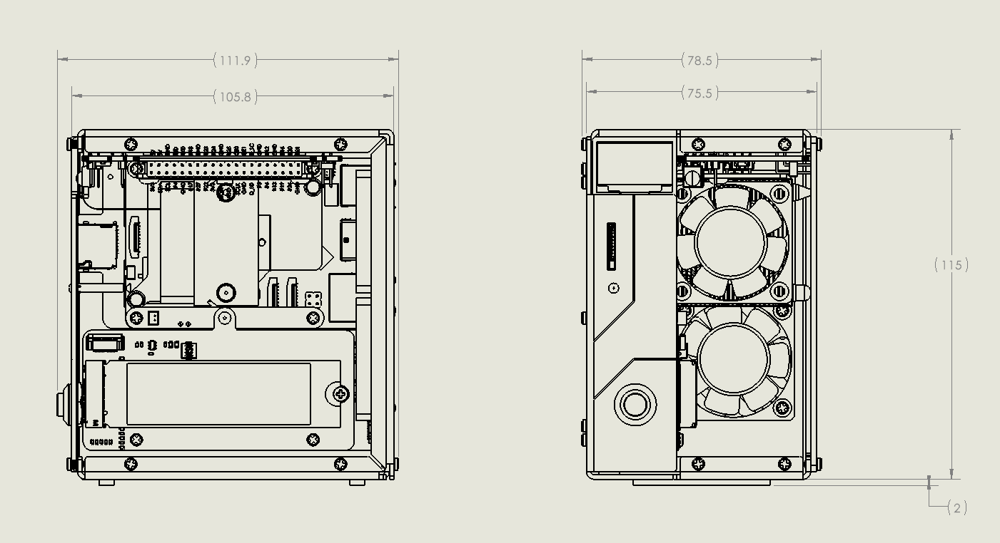

.. note::

    こんにちは、SunFounderのRaspberry Pi & Arduino & ESP32愛好家コミュニティへようこそ！Facebook上でRaspberry Pi、Arduino、ESP32についてもっと深く掘り下げ、他の愛好家と交流しましょう。

    **参加する理由は？**

    - **エキスパートサポート**：コミュニティやチームの助けを借りて、販売後の問題や技術的な課題を解決します。
    - **学び＆共有**：ヒントやチュートリアルを交換してスキルを向上させましょう。
    - **独占的なプレビュー**：新製品の発表や先行プレビューに早期アクセスしましょう。
    - **特別割引**：最新製品の独占割引をお楽しみください。
    - **祭りのプロモーションとギフト**：ギフトや祝日のプロモーションに参加しましょう。

    👉 私たちと一緒に探索し、創造する準備はできていますか？[|link_sf_facebook|]をクリックして今すぐ参加しましょう！

特徴
======================

 **パラメータ** 

* 寸法: 111.9x78.5x117mm
* 材質
    * 本体: アルミ合金
    * 両側パネル: アクリル
* 対応プラットフォーム: Raspberry Pi 5B
* 電源入力: USB Type C, 5V/5A
* インターフェース
    * Raspberry Pi標準40ピンGPIO
    * スプリング式Micro SDソケット
    * USB Type C電源入力
    * USB 2.0 x 2
    * USB 3.0 x 2
    * ギガビットLANポート
    * 4Kp60対応HDMI Type A x 2
* メタル電源ボタン
* OLEDスクリーン: 0.96インチ、解像度128x64
* PWMファン x 1、RGBファン x 2: 40x40x10mm
* WS2812-5050 RGB LED x 4
* 38KHz赤外線受信機
* タワークーラー
* NVMe SSD用PCIe 3.0 x1 M.2 Mキー 2230、2242、2260、2280対応
* RTC用1220バッテリー

 **寸法図** 

