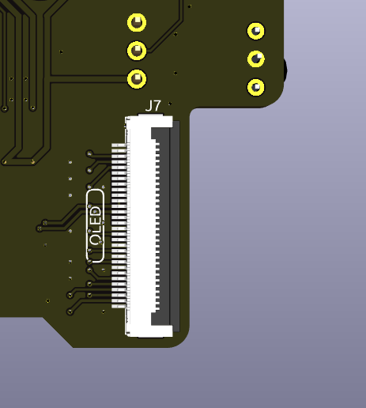
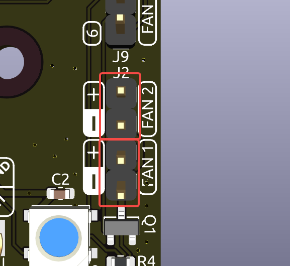
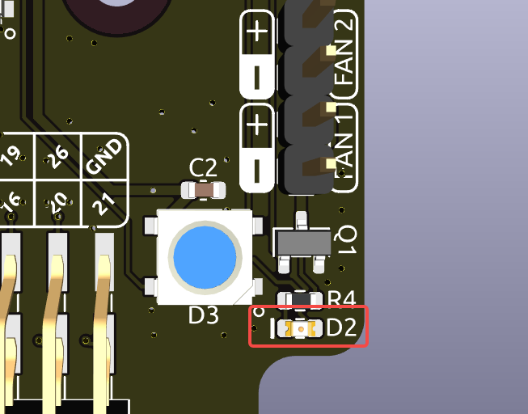
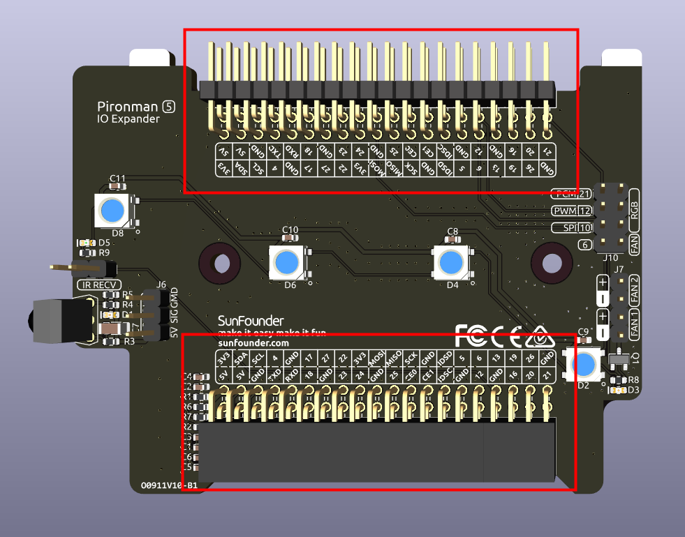

.. note::

    Hallo und willkommen in der SunFounder Raspberry Pi & Arduino & ESP32 Enthusiasten-Gemeinschaft auf Facebook! Tauchen Sie tiefer ein in die Welt von Raspberry Pi, Arduino und ESP32 mit anderen Enthusiasten.

    **Warum beitreten?**

    - **Expertenunterstützung**: Lösen Sie Nachverkaufsprobleme und technische Herausforderungen mit Hilfe unserer Gemeinschaft und unseres Teams.
    - **Lernen & Teilen**: Tauschen Sie Tipps und Anleitungen aus, um Ihre Fähigkeiten zu verbessern.
    - **Exklusive Vorschauen**: Erhalten Sie frühzeitigen Zugang zu neuen Produktankündigungen und exklusiven Einblicken.
    - **Spezialrabatte**: Genießen Sie exklusive Rabatte auf unsere neuesten Produkte.
    - **Festliche Aktionen und Gewinnspiele**: Nehmen Sie an Gewinnspielen und Feiertagsaktionen teil.

    👉 Sind Sie bereit, mit uns zu erkunden und zu erschaffen? Klicken Sie auf [|link_sf_facebook|] und treten Sie heute bei!

IO-Expander
================

RGB-LEDs
------------

.. image:: img/io_board_rgb.png

Das Board verfügt über 4 WS2812 RGB-LEDs, die individuell steuerbar sind. Benutzer können sie ein- und ausschalten, die Farbe ändern, die Helligkeit anpassen, Anzeigemodi wechseln und die Änderungsrate einstellen.

* Um den Ein- und Ausschaltzustand der RGB-LEDs zu ändern, verwenden Sie ``true`` zum Einschalten der RGB-LEDs und ``false`` zum Ausschalten.

.. code-block:: shell

  pironman5 -re true

* Um die Farbe zu ändern, geben Sie die gewünschten hexadezimalen Farbwerte ein, z.B. ``fe1a1a``.

.. code-block:: shell

  pironman5 -rc fe1a1a

* Um die Helligkeit der RGB-LED (Bereich: 0 ~ 100%) zu ändern:

.. code-block:: shell

  pironman5 -rb 100

* Um den Anzeigemodus der RGB-LED zu wechseln, wählen Sie aus den Optionen: ``solid/breathing/flow/flow_reverse/rainbow/rainbow_reverse/hue_cycle``:

.. note::

  Wenn Sie den Anzeigemodus der RGB-LED auf ``rainbow``, ``rainbow_reverse`` oder ``hue_cycle`` einstellen, können Sie die Farbe nicht mit ``pironman5 -rc`` festlegen.

.. code-block:: shell

  pironman5 -rs breathing

* Um die Änderungsrate (Bereich: 0 ~ 100%) zu ändern:

.. code-block:: shell

  pironman5 -rp 80

RGB-Steuerpin
-------------------------

Die RGB-LED wird über SPI angesteuert und ist mit **GPIO10** verbunden, das auch der SPI-MOSI-Pin ist. Die beiden Pins über J9 werden verwendet, um das RGB an GPIO10 anzuschließen. Wenn nicht benötigt, kann der Jumper entfernt werden.

  .. image:: img/io_board_rgb_pin.png

RGB OUT Pins
-------------------------

.. image:: img/io_board_rgb_out.png

Die WS2812 RGB-LEDs unterstützen eine serielle Verbindung, sodass ein externer RGB-LED-Streifen angeschlossen werden kann. Verbinden Sie den **SIG**-Pin mit dem **DIN**-Pin des externen Streifens zur Erweiterung.

Die Standardkonfiguration umfasst 4 RGB-LEDs. Schließen Sie zusätzliche LEDs an und aktualisieren Sie die Anzahl mit:

.. code-block:: shell

  pironman5 -rl 12

OLED-Bildschirmanschluss
----------------------------

Der OLED-Bildschirmanschluss mit einer Adresse von 0x3C ist ein wichtiges Merkmal.

Wenn der OLED-Bildschirm nicht angezeigt wird oder fehlerhaft angezeigt wird, können Sie folgende Schritte zur Fehlerbehebung durchführen:

Überprüfen Sie, ob das FPC-Kabel des OLED-Bildschirms richtig angeschlossen ist.

#. Verwenden Sie den folgenden Befehl, um die Protokolle des Programms anzuzeigen und nach Fehlermeldungen zu suchen.

    .. code-block:: shell

        cat /opt/pironman5/log

#. Alternativ können Sie den folgenden Befehl verwenden, um zu überprüfen, ob die i2c-Adresse 0x3C des OLED erkannt wird:
    
    .. code-block:: shell
        
        sudo i2cdetect -y 1

#. Wenn die ersten beiden Schritte keine Probleme aufzeigen, versuchen Sie, den pironman5-Dienst neu zu starten, um zu sehen, ob das Problem behoben wird.

    .. code-block:: shell

        sudo systemctl restart pironman5.service

Infrarotempfänger
---------------------------

.. image:: img/io_board_receiver.png

* **Modell**: IRM-56384, Betrieb bei 38KHz.
* **Verbindung**: Der IR-Empfänger wird mit **GPIO13** verbunden.
* **D1**: Ein Infrarotempfangs-Indikator, der bei Signalerkennung blinkt.
* **J8**: Ein Pin zur Aktivierung der Infrarotfunktion. Standardmäßig ist eine Jumperkappe eingesetzt, um die Funktion sofort zu ermöglichen. Entfernen Sie die Kappe, um GPIO13 freizugeben, wenn der IR-Empfänger nicht verwendet wird.

Um den IR-Empfänger zu nutzen, überprüfen Sie die Verbindung und installieren Sie das erforderliche Modul:

* Testen Sie die Verbindung:

  .. code-block:: shell

    sudo ls /dev |grep lirc

* Installieren Sie das ``lirc``-Modul:

  .. code-block:: shell

    sudo apt-get install lirc -y

* Testen Sie nun den IR-Empfänger mit dem folgenden Befehl:

  .. code-block:: shell

    mode2 -d /dev/lirc0

* Nachdem Sie den Befehl ausgeführt haben, drücken Sie eine Taste auf der Fernbedienung, und der Code dieser Taste wird angezeigt.

RGB-Lüfterpins
------------------

Das IO-Erweiterungsboard unterstützt bis zu zwei 5V Nicht-PWM-Lüfter. Beide Lüfter werden gemeinsam gesteuert.

**FAN1** und **FAN2** sind zwei Lüfterpinsätze. Sie müssen das rote Kabel des Lüfters an "+" und das schwarze Kabel an "-" anschließen.

Die beiden Pins unter J9 sind die Aktivierungspins für RGB-Lüfter. Standardmäßig ist ein Jumper auf diesen Pins eingesetzt, sodass die Lüfter über GPIO6 ein- und ausgeschaltet werden können. Wenn der Lüfterbetrieb nicht gewünscht ist, kann der Jumper entfernt werden, um GPIO6 freizugeben.

.. image:: img/io_board_fan_j9.png

**D2** ist ein Lüftersignal-Indikator, der leuchtet, wenn der Lüfter aktiv ist.

Sie können den Befehl verwenden, um den Betriebsmodus der beiden RGB-Lüfter zu konfigurieren. Diese Modi bestimmen die Bedingungen, unter denen die RGB-Lüfter aktiviert werden.

Beispielsweise aktivieren sich die RGB-Lüfter im **1: Performance**-Modus bei 50°C.

.. code-block:: shell

  pironman5 -gm 3

* **4: Quiet**: Die RGB-Lüfter aktivieren sich bei 70°C.
* **3: Balanced**: Die RGB-Lüfter aktivieren sich bei 67,5°C.
* **2: Cool**: Die RGB-Lüfter aktivieren sich bei 60°C.
* **1: Performance**: Die RGB-Lüfter aktivieren sich bei 50°C.
* **0: Always On**: Die RGB-Lüfter sind immer eingeschaltet.

Wenn Sie den Steuerpin des RGB-Lüfters an andere Pins des Raspberry Pi anschließen, können Sie den folgenden Befehl verwenden, um die Pinnummer zu ändern.

.. code-block:: shell

  sudo pironman5 -gp 18

Pin-Header
--------------

Zwei rechtwinklige Header-Steckverbinder erweitern das GPIO des Raspberry Pi, beachten Sie jedoch, dass der IR-Empfänger, die RGB-LED und der Lüfter einige Pins belegen. Entfernen Sie die entsprechenden Jumperkappen, um diese Pins für andere Funktionen zu nutzen.

.. list-table:: 
  :widths: 25 25
  :header-rows: 1

  * - |link_pironman5|
    - Raspberry Pi 5
  * - IR-Empfänger (Optional)
    - GPIO13
  * - OLED SDA
    - SDA
  * - OLED SCL
    - SCL
  * - Lüfter (Optional)
    - GPIO6
  * - RGB (Optional)
    - GPIO10
  * - RGB (Optional)
    - GPIO12
  * - RGB (Optional)
    - GPIO21
