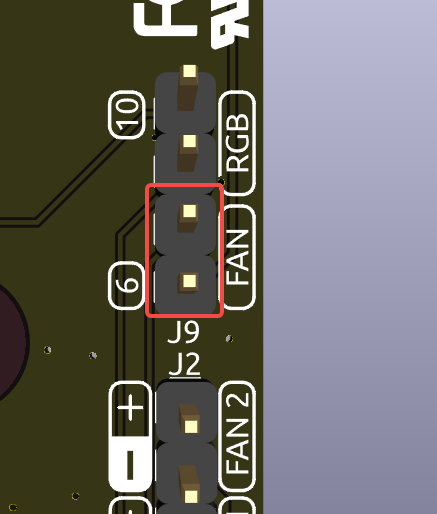

IOエキスパンダー
================

RGB LED
------------

.. image:: img/io_board_rgb.png

このボードには4つのWS2812 RGB LEDが搭載されており、カスタマイズ可能な制御が可能です。ユーザーはLEDをオン/オフにしたり、色を変更したり、明るさを調整したり、表示モードを切り替えたり、変化速度を設定できます。

* RGB LEDのオン/オフを変更するには、 ``true`` でRGB LEDをオンに、 ``false`` でオフにします。

.. code-block:: shell

  pironman5 -re true

* 色を変更するには、希望の16進数のカラー値を入力します。例： ``fe1a1a``。

.. code-block:: shell

  pironman5 -rc fe1a1a

* RGB LEDの明るさを変更するには（範囲：0〜100％）：

.. code-block:: shell

  pironman5 -rb 100

* RGB LEDの表示モードを切り替えるには、次のオプションから選択します： ``solid/breathing/flow/flow_reverse/rainbow/rainbow_reverse/hue_cycle``。

.. note::

  RGB LEDの表示モードを ``rainbow``、 ``rainbow_reverse``、または ``hue_cycle`` に設定した場合、 ``pironman5 -rc`` を使用して色を設定することはできません。

.. code-block:: shell

  pironman5 -rs breathing

* 変化速度を変更するには（範囲：0〜100％）：

.. code-block:: shell

  pironman5 -rp 80

RGB制御ピン
-------------------------

RGB LEDはSPIで駆動され、 **GPIO10** （SPI MOSIピン）に接続されています。J9の上部にある2つのピンは、RGBをGPIO10に接続するために使用されます。不要な場合はジャンパーを取り外せます。

  .. image:: img/io_board_rgb_pin.png

RGB出力ピン
-------------------------

.. image:: img/io_board_rgb_out.png

WS2812 RGB LEDは直列接続をサポートしており、外部RGB LEDストリップを接続できます。 **SIG** ピンを外部ストリップの **DIN** ピンに接続して拡張します。

デフォルト設定には4つのRGB LEDが含まれています。追加のLEDを接続し、数を更新します：

.. code-block:: shell

  pironman5 -rl 12

OLEDスクリーンコネクタ
----------------------------

アドレス0x3CのOLEDスクリーンコネクタは重要な機能です。

.. image:: img/io_board_oled.png

OLEDスクリーンが表示されない、または正しく表示されない場合は、以下の手順で問題を解決できます：

OLEDスクリーンのFPCケーブルが正しく接続されているか確認します。

#. 次のコマンドを使用してプログラムの実行ログを表示し、エラーメッセージを確認します。

    .. code-block:: shell

        cat /opt/pironman5/log

#. または、次のコマンドを使用してOLEDのi2cアドレス0x3Cが認識されているか確認します：
    
    .. code-block:: shell
        
        sudo i2cdetect -y 1

#. 最初の2つの手順で問題が明らかにならない場合は、pironman5サービスを再起動して問題が解決するか確認してください。

    .. code-block:: shell

        sudo systemctl restart pironman5.service

赤外線受信機
---------------------------

.. image:: img/io_board_receiver.png

* **モデル**: IRM-56384、38KHzで動作。
* **接続**: 赤外線受信機は **GPIO13** に接続されます。
* **D1**: 信号検出時に点滅する赤外線受信インジケータ。
* **J8**: 赤外線機能を有効にするためのピン。デフォルトではジャンパーキャップが挿入されており、すぐに使用可能です。IR受信機を使用しない場合は、キャップを取り外してGPIO13を解放します。

赤外線受信機を利用するには、その接続を確認し、必要なモジュールをインストールします：

* 接続をテスト：

  .. code-block:: shell

    sudo ls /dev |grep lirc

* ``lirc`` モジュールをインストール：

  .. code-block:: shell

    sudo apt-get install lirc -y

* 次のコマンドを実行して赤外線受信機をテストします。

  .. code-block:: shell

    mode2 -d /dev/lirc0

* コマンドを実行したら、リモコンのボタンを押し、そのボタンのコードが表示されます。

RGBファンピン
---------------

IOエキスパンダーボードは最大2つの5V非PWMファンをサポートしています。両方のファンは一緒に制御されます。

 **FAN1** と **FAN2** は2セットのファンピンです。ファンの赤い線を「+」に、黒い線を「-」に接続します。

.. image:: img/io_board_fan.png

J9の下部にある2つのピンはRGBファンの有効化ピンです。デフォルトでは、これらのピンにジャンパーが挿入されており、GPIO6を使用してファンのオン/オフを制御できます。ファンの動作が不要な場合は、ジャンパーを取り外してGPIO6を解放します。

**D2** はファンが動作中に点灯するファン信号インジケータです。

2つのRGBファンの動作モードを構成するコマンドを使用できます。これらのモードは、RGBファンが作動する条件を決定します。

例えば、 **1: Performance** モードに設定すると、RGBファンは50°Cで作動します。

.. code-block:: shell

  pironman5 -gm 3

* **4: Quiet**: RGBファンは70°Cで作動します。
* **3: Balanced**: RGBファンは67.5°Cで作動します。
* **2: Cool**: RGBファンは60°Cで作動します。
* **1: Performance**: RGBファンは50°Cで作動します。
* **0: Always On**: RGBファンは常に作動します。

RGBファンの制御ピンをRaspberry Piの異なるピンに接続する場合、次のコマンドを使用してピン番号を変更できます。

.. code-block:: shell

  sudo pironman5 -gp 18

ピンヘッダー
--------------

.. image:: img/io_board_pin_header.png

2つの直角ヘッダーコネクタはRaspberry PiのGPIOを拡張しますが、赤外線受信機、RGB LED、およびファンがいくつかのピンを占有しています。これらのピンを他の機能に利用するには、対応するジャンパーキャップを取り外します。

.. list-table:: 
  :widths: 25 25
  :header-rows: 1

  * - |link_pironman5|
    - Raspberry Pi 5
  * - 赤外線受信機（オプション）
    - GPIO13
  * - OLED SDA
    - SDA
  * - OLED SCL
    - SCL
  * - FAN（オプション）
    - GPIO6
  * - RGB（オプション）
    - GPIO10
  * - RGB（オプション）
    - GPIO12
  * - RGB（オプション）
    - GPIO21

