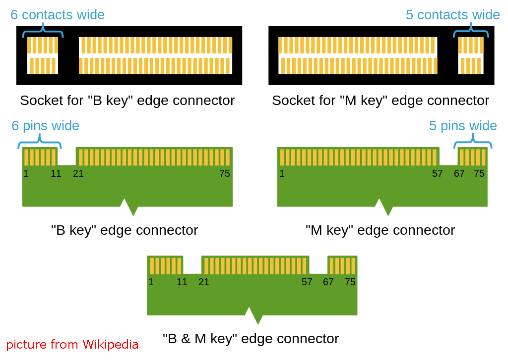

Pi5 NVMe PIP
=================

Raspberry Pi Foundationが定義するPi5 NVMe PIP（PCIe周辺基板）は、NVMeソリッドステートドライブ専用に設計されたPCIeアダプターボードです。2230、2242、2260、2280の4つの異なるサイズのNVMe SSDをサポートし、すべてがM.2 Mキーのスロットに適合します。

* このボードは、16P 0.5mmリバースFFC（フレキシブルフラットケーブル）またはインピーダンスマッチングされたカスタムFPC（フレキシブルプリント回路）ケーブルを介して接続します。
* **STA**: ステータスLEDインジケーター。
* **PWR**: 電源LEDインジケーター。
* オンボードの3.3V電源は最大3Aの出力をサポートします。ただし、Raspberry PiのPCIeインターフェイスは5V/1A出力（5W相当）に制限されているため、3.3V/3Aの追加電源はJ3コネクターを介して5Vのソースから供給することができます。

モデルについて
---------------------------

コンパクトなサイズで知られるM.2 SSDは、主にコネクタのノッチデザイン（キー）と使用するインターフェイスによって区別されます。以下は主なタイプです：

* **M.2 SATA SSD**: これらはSATAインターフェースを使用し、2.5インチSATA SSDと同様ですが、より小型のM.2フォームファクターを持ちます。最大速度はSATA IIIの約600 MB/sに制限されます。これらのSSDはBキーとMキーのスロットに対応しています。
* **M.2 NVMe SSD**: これらのSSDはPCIeレーン上のNVMeプロトコルを使用し、M.2 SATA SSDよりもはるかに高速です。ゲーム、ビデオ編集、データ集約型タスクなど高い読み取り/書き込み速度を必要とするアプリケーションに適しています。これらのSSDは通常Mキーのスロットを必要とします。これらのドライブはPCIe（Peripheral Component Interconnect Express）インターフェースを使用し、3.0、4.0、5.0などの異なるバージョンがあります。各新バージョンは前のバージョンのデータ転送速度を倍増させます。ただし、Raspberry Pi 5はPCIe 3.0インターフェースを使用しており、最大3,500 MB/sの転送速度を提供できます。

M.2 SSDはBキー、Mキー、B+Mキーの3つの主要なタイプがあります。しかし、後にB+Mキーが導入され、BキーとMキーの機能を組み合わせたため、単独のBキーを置き換えました。以下の画像をご覧ください。

一般に、M.2 SATA SSDはB+Mキー（BキーおよびMキーのモジュール用ソケットに適合）であり、PCIe 3.0 x4レーンのM.2 NVMe SSDはMキーです。

.. image:: img/ssd_model2.png

長さについて
-----------------------

M.2モジュールは異なるサイズがあり、Wi-Fi、WWAN、Bluetooth、GPS、NFCにも利用できます。

 |link_pironman5| link_pironman5|は、名前に基づいて4つの（PCIE2.0 / PCIE 3.0）NVMe M.2 SSDサイズ2230、2242、2260、2280をサポートします。「22」は幅をミリメートル（mm）で表し、その後の2桁の数字は長さを示します。ドライブが長いほど、より多くのNANDフラッシュチップを搭載できるため、容量が増えます。

.. image:: img/m2_ssd_size.png
  :width: 600

