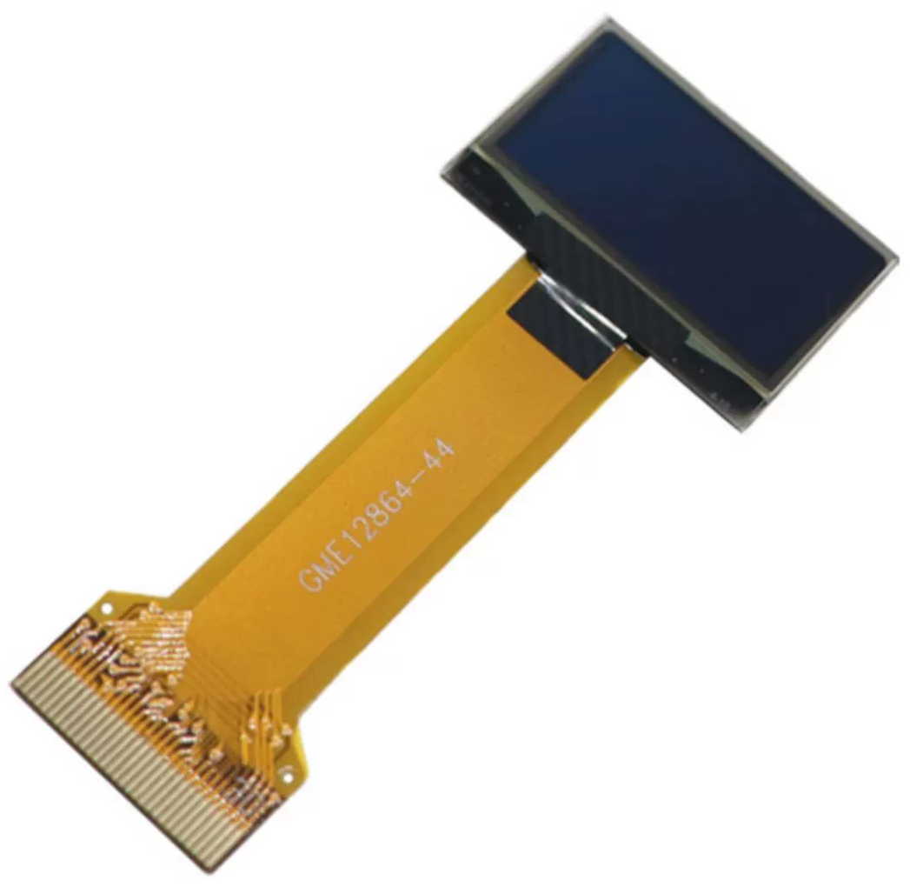

.. note::

    Hallo und willkommen in der SunFounder Raspberry Pi & Arduino & ESP32 Enthusiasten-Gemeinschaft auf Facebook! Tauchen Sie tiefer ein in die Welt von Raspberry Pi, Arduino und ESP32 mit anderen Enthusiasten.

    **Warum beitreten?**

    - **Expertenunterstützung**: Lösen Sie Nachverkaufsprobleme und technische Herausforderungen mit Hilfe unserer Gemeinschaft und unseres Teams.
    - **Lernen & Teilen**: Tauschen Sie Tipps und Anleitungen aus, um Ihre Fähigkeiten zu verbessern.
    - **Exklusive Vorschauen**: Erhalten Sie frühzeitigen Zugang zu neuen Produktankündigungen und exklusiven Einblicken.
    - **Spezialrabatte**: Genießen Sie exklusive Rabatte auf unsere neuesten Produkte.
    - **Festliche Aktionen und Gewinnspiele**: Nehmen Sie an Gewinnspielen und Feiertagsaktionen teil.

    👉 Sind Sie bereit, mit uns zu erkunden und zu erschaffen? Klicken Sie auf [|link_sf_facebook|] und treten Sie heute bei!

OLED-Bildschirm
===================

* **Größe**: 0,96''
* **Material**: PM OLED
* **Farbe**: Weiß
* **Treiber**: SSD1306
* **Spannung**: 3,3V
* **Auflösung**: 128*64
* **Anzeigebereich**: 21,74x10,86mm
* **Panelgröße**: 26,70x19,26x1,42mm
* **Pixelabstand**: 0,17x0,17mm
* **Pixelgröße**: 0,154x0,154mm
* **Blickwinkel**: Vollansicht
* **Betriebstemperatur**: -20~70°C
* **Kommunikationsmethode**: IIC/SPI/Parallel
* **Verbindungsmethode**: 0,5mm Raster-Stecktyp FPC
