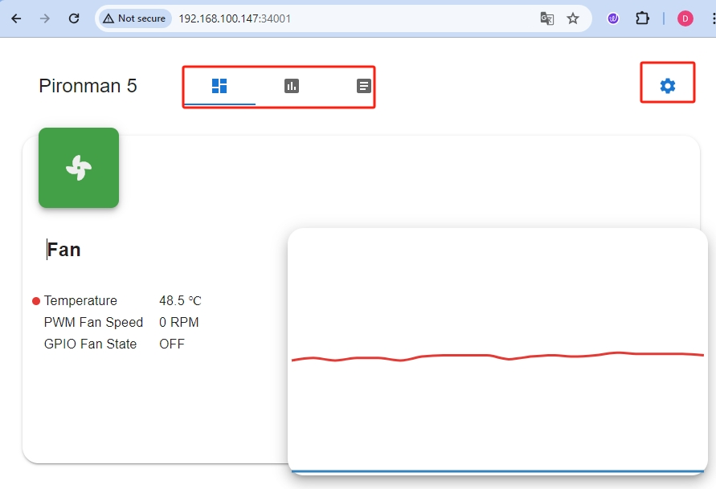
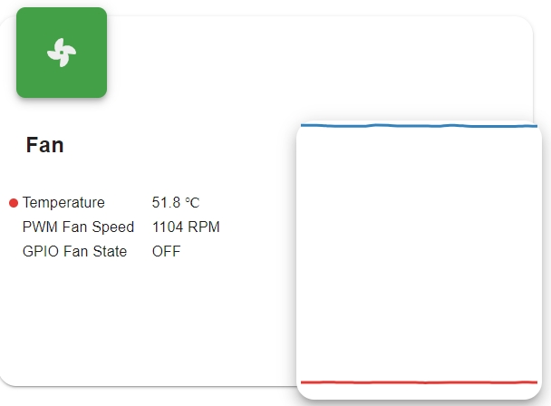
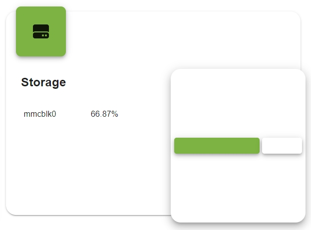
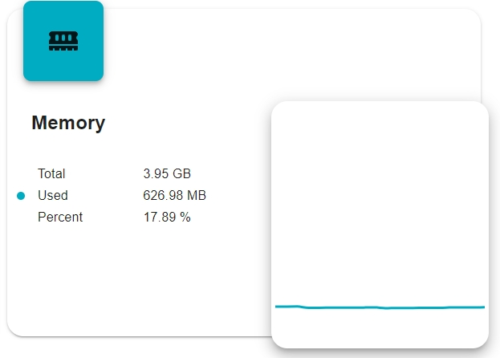
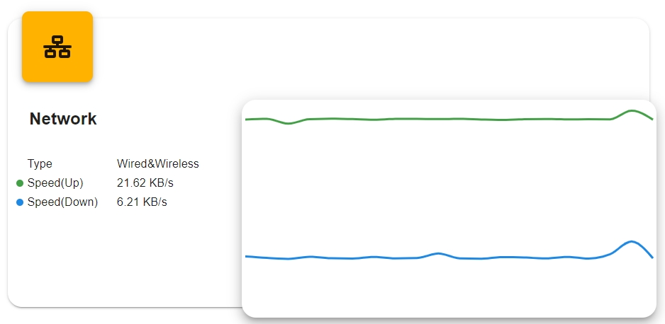
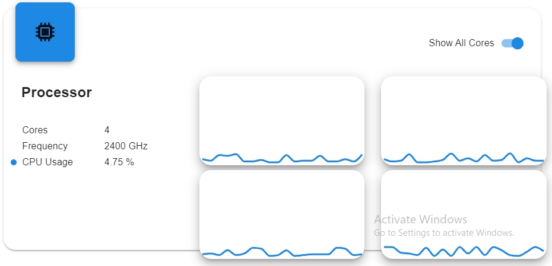
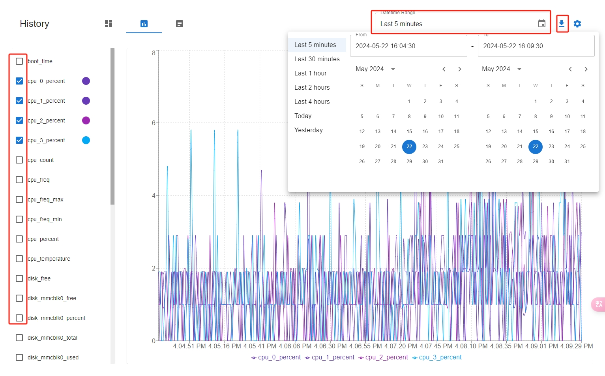
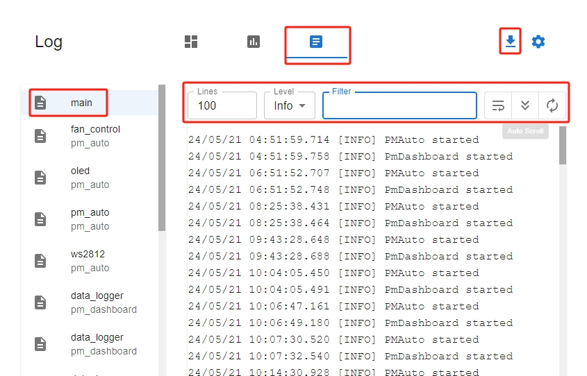
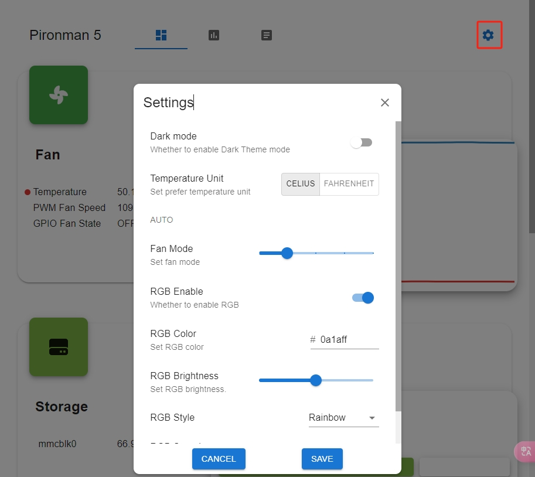

.. note::

    Hallo und willkommen in der SunFounder Raspberry Pi & Arduino & ESP32 Enthusiasten-Gemeinschaft auf Facebook! Tauchen Sie tiefer ein in die Welt von Raspberry Pi, Arduino und ESP32 mit anderen Enthusiasten.

    **Warum beitreten?**

    - **Expertenunterstützung**: Lösen Sie Nachverkaufsprobleme und technische Herausforderungen mit Hilfe unserer Gemeinschaft und unseres Teams.
    - **Lernen & Teilen**: Tauschen Sie Tipps und Anleitungen aus, um Ihre Fähigkeiten zu verbessern.
    - **Exklusive Vorschauen**: Erhalten Sie frühzeitigen Zugang zu neuen Produktankündigungen und exklusiven Einblicken.
    - **Spezialrabatte**: Genießen Sie exklusive Rabatte auf unsere neuesten Produkte.
    - **Festliche Aktionen und Gewinnspiele**: Nehmen Sie an Gewinnspielen und Feiertagsaktionen teil.

    👉 Sind Sie bereit, mit uns zu erkunden und zu erschaffen? Klicken Sie auf [|link_sf_facebook|] und treten Sie heute bei!

.. _view_control_dashboard:

6. Überwachung und Steuerung über das Dashboard
=========================================================

Nach erfolgreicher Installation des ``pironman5``-Moduls startet der Dienst ``pironman5.service`` automatisch beim Neustart.

Nun können Sie die Überwachungsseite in Ihrem Browser öffnen, um Informationen über Ihren Raspberry Pi zu sehen, die RGB-Beleuchtung zu konfigurieren und den Lüfter zu steuern. Der Link zur Seite lautet: ``http://<ip>:34001``.

Diese Seite umfasst **Dashboard**, **Historie**, **Log** und eine **Einstellungen**-Seite.

Dashboard
-----------------------

Es gibt mehrere Karten, um den Status des Raspberry Pi anzuzeigen, darunter:

* **Lüfter**: Zeigt die CPU-Temperatur des Raspberry Pi und die PWM-Lüftergeschwindigkeit an. **GPIO Lüfterstatus** zeigt den Status der beiden seitlichen RGB-Lüfter an. Bei der aktuellen Temperatur sind die beiden RGB-Lüfter ausgeschaltet.

* **Speicher**: Zeigt die Speicherkapazität des Raspberry Pi an und zeigt verschiedene Partitionen mit ihrem belegten und freien Speicherplatz.

* **Arbeitsspeicher**: Zeigt die RAM-Auslastung des Raspberry Pi und den Prozentsatz der Nutzung an.

* **Netzwerk**: Zeigt den aktuellen Netzwerkverbindungstyp sowie Upload- und Download-Geschwindigkeiten an.

* **Prozessor**: Veranschaulicht die CPU-Leistung des Raspberry Pi, einschließlich des Status seiner vier Kerne, der Betriebsfrequenzen und der CPU-Auslastung in Prozent.

Historie
--------------

Auf der Historie-Seite können Sie historische Daten einsehen. Wählen Sie die Daten, die Sie anzeigen möchten, in der linken Seitenleiste aus, dann wählen Sie den Zeitraum, um die Daten für diesen Zeitraum anzuzeigen, und Sie können sie auch herunterladen.

Log
------------

Die Log-Seite dient zur Ansicht der Protokolle des aktuell laufenden Pironman5-Dienstes. Der Pironman5-Dienst umfasst mehrere Unterdienste, von denen jeder ein eigenes Protokoll hat. Wählen Sie das Protokoll aus, das Sie ansehen möchten, und Sie sehen die Protokolldaten auf der rechten Seite. Wenn es leer ist, bedeutet dies möglicherweise, dass es keine Protokollinhalte gibt.

* Jedes Protokoll hat eine feste Größe von 10 MB. Wenn diese Größe überschritten wird, wird ein zweites Protokoll erstellt.
* Die Anzahl der Protokolle für denselben Dienst ist auf 10 begrenzt. Wenn diese Anzahl überschritten wird, wird das älteste Protokoll automatisch gelöscht.
* Über dem Protokollbereich auf der rechten Seite befinden sich Filterwerkzeuge. Sie können das Protokollniveau auswählen, nach Schlüsselwörtern filtern und mehrere praktische Werkzeuge wie **Zeilenumbruch**, **Auto-Scroll** und **Auto-Update** verwenden.
* Protokolle können auch lokal heruntergeladen werden.

Einstellungen
-----------------

Es gibt ein Einstellungsmenü in der oberen rechten Ecke der Seite.

.. note::
    
    Nach einer Änderung müssen Sie auf die **SPEICHERN**-Schaltfläche unten klicken, um die Einstellungen zu speichern.

* **Dunkler Modus**: Wechseln zwischen hellem und dunklem Modus. Die Thema-Option wird im Browsercache gespeichert. Ein Wechsel des Browsers oder das Löschen des Caches setzt das Standard-Thema auf hell zurück.
* **Temperatureinheit**: Legen Sie die Temperatureinheit fest, die vom System angezeigt wird.
* **Lüftermodus**: Sie können den Betriebsmodus der beiden RGB-Lüfter festlegen. Diese Modi bestimmen, unter welchen Bedingungen die RGB-Lüfter aktiviert werden.

    * **Leise**: Die RGB-Lüfter werden bei 70°C aktiviert.
    * **Ausgeglichen**: Die RGB-Lüfter werden bei 67,5°C aktiviert.
    * **Kühl**: Die RGB-Lüfter werden bei 60°C aktiviert.
    * **Leistung**: Die RGB-Lüfter werden bei 50°C aktiviert.
    * **Immer an**: Die RGB-Lüfter sind immer eingeschaltet.

    Wenn beispielsweise der **Leistungs**-Modus eingestellt ist, werden die RGB-Lüfter bei 50°C aktiviert.

    Nach dem Speichern, wenn die CPU-Temperatur 50°C überschreitet, sehen Sie, dass der **GPIO Lüfterstatus** im Dashboard auf EIN wechselt und die seitlichen RGB-Lüfter zu drehen beginnen.

    .. image:: img/dashboard_rgbfan_on.png
        :width: 300
        :align: center

* **RGB-Helligkeit**: Sie können die Helligkeit der RGB-LEDs mit einem Schieberegler einstellen.
* **RGB-Farbe**: Legen Sie die Farbe der RGB-LEDs fest.
* **RGB-Stil**: Wählen Sie den Anzeigemodus der RGB-LEDs. Zu den Optionen gehören **Solid**, **Breathing**, **Flow**, **Flow_reverse**, **Rainbow**, **Rainbow Reverse** und **Hue Cycle**.

.. note::

  Wenn Sie den **RGB-Stil** auf **Rainbow**, **Rainbow Reverse** und **Hue Cycle** einstellen, können Sie die Farbe nicht festlegen.

* **RGB-Geschwindigkeit**: Legen Sie die Geschwindigkeit der RGB-LED-Änderungen fest.
