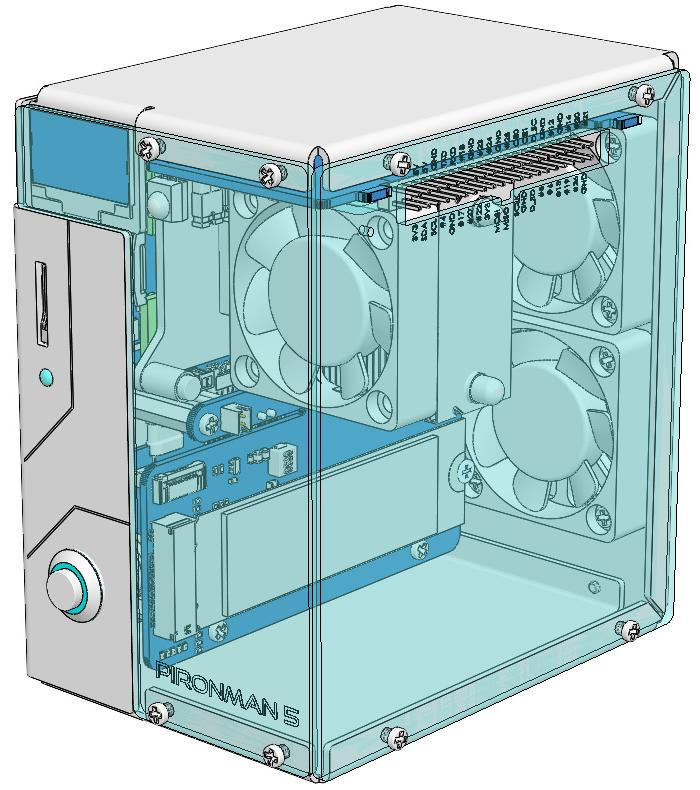

.. note::

    Hallo und willkommen in der SunFounder Raspberry Pi & Arduino & ESP32 Enthusiasten-Gemeinschaft auf Facebook! Tauchen Sie tiefer ein in die Welt von Raspberry Pi, Arduino und ESP32 mit anderen Enthusiasten.

    **Warum beitreten?**

    - **Expertenunterstützung**: Lösen Sie Nachverkaufsprobleme und technische Herausforderungen mit Hilfe unserer Gemeinschaft und unseres Teams.
    - **Lernen & Teilen**: Tauschen Sie Tipps und Anleitungen aus, um Ihre Fähigkeiten zu verbessern.
    - **Exklusive Vorschauen**: Erhalten Sie frühzeitigen Zugang zu neuen Produktankündigungen und exklusiven Einblicken.
    - **Spezialrabatte**: Genießen Sie exklusive Rabatte auf unsere neuesten Produkte.
    - **Festliche Aktionen und Gewinnspiele**: Nehmen Sie an Gewinnspielen und Feiertagsaktionen teil.

    👉 Sind Sie bereit, mit uns zu erkunden und zu erschaffen? Klicken Sie auf [|link_sf_facebook|] und treten Sie heute bei!

|link_pironman5| - NVMe M.2 SSD PCIe Mini-PC-Gehäuse für Raspberry Pi 5
================================================================================

Vielen Dank, dass Sie sich für unser |link_pironman5| entschieden haben.

.. note::
    Dieses Dokument ist in den folgenden Sprachen verfügbar.

        * |link_german_tutorials|
        * |link_jp_tutorials|
        * |link_en_tutorials|
    
    Bitte klicken Sie auf die entsprechenden Links, um das Dokument in Ihrer bevorzugten Sprache zu öffnen.

Verleihen Sie Ihrem Raspberry Pi 5 mit dem |link_pironman5|, unserem erstklassigen Gehäuse, einen Hauch von Stil und Funktionalität. Es ist die perfekte Kombination aus Ästhetik und Leistung:

* Raspberry Pi 5 Mini-PC
* 0,96" OLED-Display zeigt CPU-Auslastung, Temperatur, Speichernutzung, IP-Adresse, RAM-Auslastung usw. des Raspberry Pi an
* Turmkühler kann einen 100% ausgelasteten Raspberry Pi bei 25°C Raumtemperatur auf 39°C kühlen
* 2 RGB-Lüfter mit GPIO-Steuerung
* 1 PWM-Lüfter am Turmkühler wird vom Raspberry Pi-System gesteuert
* Unterstützt vier NVMe M.2 SSD-Größen (PCIE2.0 / PCIE 3.0): 2230, 2242, 2260 und 2280
* 4 WS2812 adressierbare RGB-LEDs beleuchten das gesamte Gehäuse mit coolen Lichteffekten
* IR-Empfänger für Multimedia-Zentren wie Kodi oder Volumio
* Retro-Metall-Power-Button für sicheres Herunterfahren
* Externer GPIO-Erweiterer mit Pin-Namensschild für einfachen Zugriff
* Ausgestattet mit einem federbelasteten Sockel für einfaches Entfernen der Karte
* Aluminium-Hauptgehäuse mit klaren Acryl-Seitenwänden
* Verfügt über zwei Standard-HDMI-Anschlüsse

Das |link_pironman5| ist nicht nur ein Gehäuse; es ist ein Upgrade, das Ihren Raspberry Pi 5 in ein leistungsstarkes, effizientes und stilvolles Gerät verwandelt. Holen Sie sich jetzt Ihres und erleben Sie die Zukunft der Raspberry Pi-Gehäuse!

.. note::

    Sie müssen ein Betriebssystem installieren, das den Raspberry Pi 5 unterstützt. Bitte verwenden Sie das neueste Raspberry Pi Imager-Tool zur Installation des Systems. Die derzeit getesteten Systeme sind:

    * **Raspberry Pi OS (Bookworm 64 Desktop / Lite)**: Perfekt kompatibel
    * **Ubuntu Desktop 23.10**: Kein SPI, wodurch die LED nicht leuchtet
    * **Kali**: Kein I2C, wodurch der OLED-Bildschirm nicht leuchtet
    * **Home Assistant**: Kann I2C und SPI nicht aktivieren

Wenn Sie Fragen haben, senden Sie bitte eine E-Mail an service@sunfounder.com und wir werden so schnell wie möglich antworten.

.. raw:: html

    

.. toctree::
    :maxdepth: 2

    About this Kit <self>
    what_do_we_need    
    assembly_instructions
    pi_start/install_the_os

    pi_start/set_up_your_raspberry_pi
    set_up_pironman5
    dashboard
    advanced/advanced
    compitable_nvme_ssd
    faq

**Urheberrechtshinweis**

Alle Inhalte einschließlich, aber nicht beschränkt auf Texte, Bilder und Code in diesem Handbuch sind Eigentum der SunFounder Company. Sie dürfen es nur für persönliche Studien, Untersuchungen, Vergnügen oder andere nicht-kommerzielle oder gemeinnützige Zwecke unter Einhaltung der einschlägigen Vorschriften und Urheberrechtsgesetze verwenden, ohne die gesetzlichen Rechte des Autors und der relevanten Rechteinhaber zu verletzen. Für jede Person oder Organisation, die diese ohne Genehmigung für kommerzielle Zwecke nutzt, behält sich das Unternehmen das Recht vor, rechtliche Schritte einzuleiten.
