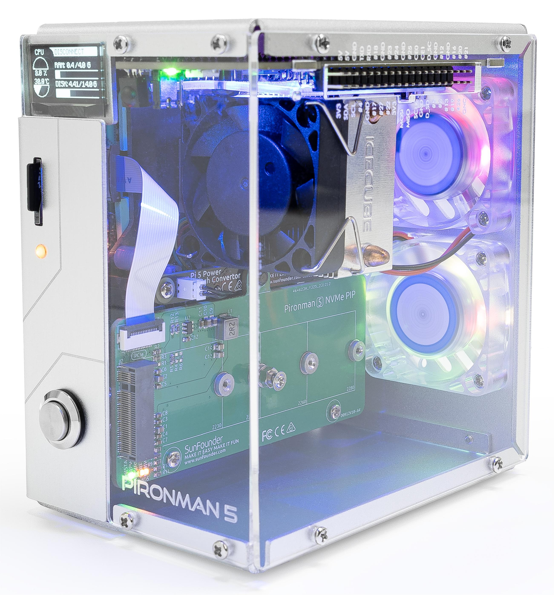

.. note::

    こんにちは、SunFounderのRaspberry Pi & Arduino & ESP32愛好家コミュニティへようこそ！Facebook上でRaspberry Pi、Arduino、ESP32についてもっと深く掘り下げ、他の愛好家と交流しましょう。

    **参加する理由は？**

    - **エキスパートサポート**：コミュニティやチームの助けを借りて、販売後の問題や技術的な課題を解決します。
    - **学び＆共有**：ヒントやチュートリアルを交換してスキルを向上させましょう。
    - **独占的なプレビュー**：新製品の発表や先行プレビューに早期アクセスしましょう。
    - **特別割引**：最新製品の独占割引をお楽しみください。
    - **祭りのプロモーションとギフト**：ギフトや祝日のプロモーションに参加しましょう。

    👉 私たちと一緒に探索し、創造する準備はできていますか？[|link_sf_facebook|]をクリックして今すぐ参加しましょう！

|link_pironman5| - NVMe M.2 SSD PCIe ミニPCケース for Raspberry Pi 5
================================================================================

|link_pironman5| をお選びいただきありがとうございます。

.. note::
    このドキュメントは以下の言語でご利用いただけます。

        * |link_german_tutorials|
        * |link_jp_tutorials|
        * |link_en_tutorials|

    ご希望の言語でドキュメントにアクセスするには、各リンクをクリックしてください。

Raspberry Pi 5を次のレベルに引き上げる |link_pironman5|。スタイルと機能性を兼ね備えた最高級ケースです。美学と性能の完璧な融合を実現：

* Raspberry Pi 5 ミニPC
* 0.96インチOLEDディスプレイ：CPU使用率、温度、ディスク使用量、IPアドレス、RAM使用量などを表示
* タワークーラー：25°C室温で100%CPU負荷のPiを39°Cまで冷却可能
* 2つのRGBファン、GPIO制御対応
* タワークーラー上の1つのPWMファンはRaspberry Piシステムによって制御
* 4種類（PCIE2.0 / PCIE 3.0）のNVMe M.2 SSDサイズに対応：2230、2242、2260、2280
* 4つのWS2812アドレス指定可能なRGB LED：ケース全体をクールな光効果で照らします
* IR受信機：KodiやVolumioなどのマルチメディアセンターに最適
* レトロなメタルパワーボタン：安全なシャットダウンを実現
* 外部GPIOエクステンダー：ピン名ラベル付きでアクセスが簡単
* 簡単なカード取り外しが可能なスプリング式ソケットを装備
* アルミ製メインボディとクリアアクリルサイドパネル
* 標準的なHDMIポートを2つ装備

|link_pironman5| は単なるケースではなく、Raspberry Pi 5を強力で効率的、そしてスタイリッシュなデバイスに変えるアップグレードです。今すぐ手に入れて、Raspberry Piケースの未来を体験してください！

.. note::

    Raspberry Pi 5をサポートするOSをインストールする必要があります。最新のRaspberry Pi Imagerツールを使用してシステムをインストールしてください。現在テスト済みのシステムは以下の通りです：

    * **Raspberry Pi OS (bookworm 64 desktop / lite)** : 完全互換
    * **Ubuntu Desktop 23.10** : SPIが動作せず、LEDが点灯しない
    * **Kali** : I2Cが動作せず、OLED画面が点灯しない
    * **Home Assistant** : I2CとSPIが有効にならない

ご質問がある場合は、service@sunfounder.comまでメールを送信してください。できるだけ早く対応いたします。

.. raw:: html

    

.. toctree::
    :maxdepth: 2

    About this Kit <self>
    what_do_we_need    
    assembly_instructions
    pi_start/install_the_os

    pi_start/set_up_your_raspberry_pi
    set_up_pironman5
    dashboard
    advanced/advanced
    compitable_nvme_ssd
    faq

**著作権表示** 

本マニュアルの内容（テキスト、画像、コードなど）はすべてSunFounder Companyの所有物です。関連する規則および著作権法の下で、著者および関連権利者の法的権利を侵害することなく、個人的な学習、調査、楽しみ、またはその他の非商業的または非営利的な目的にのみ使用してください。許可なく商業的利益のためにこれらを使用する個人または組織に対しては、当社は法的措置を取る権利を留保します。